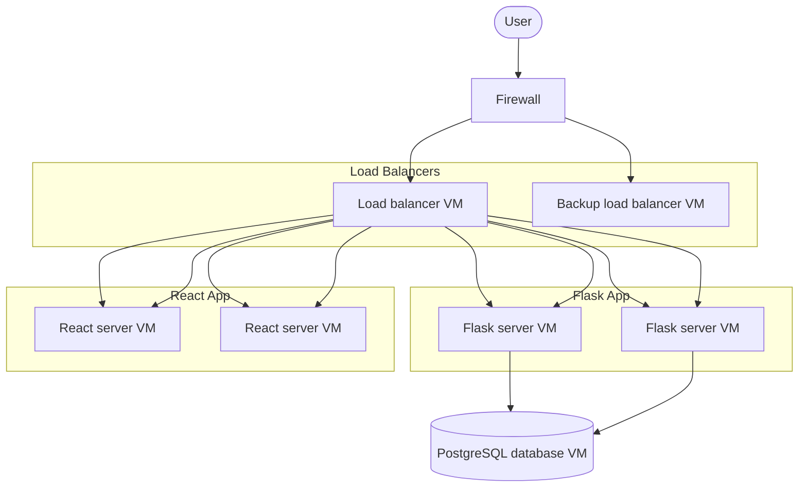
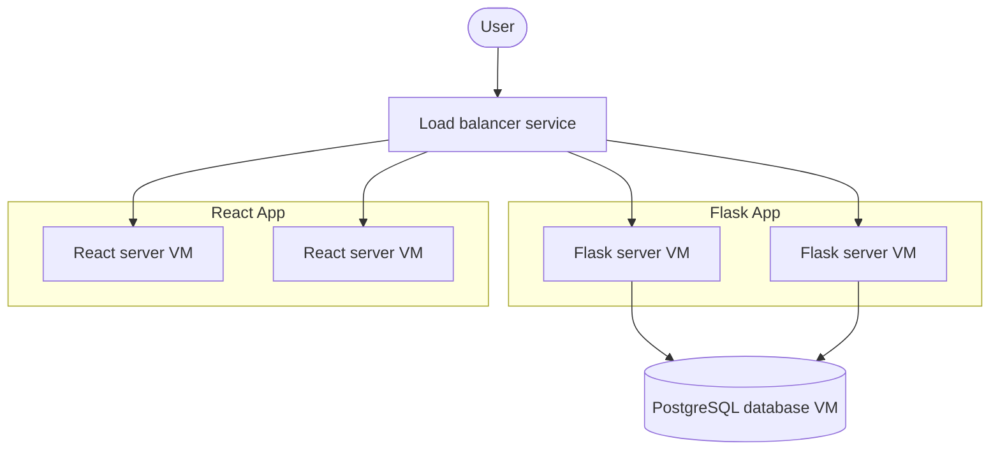
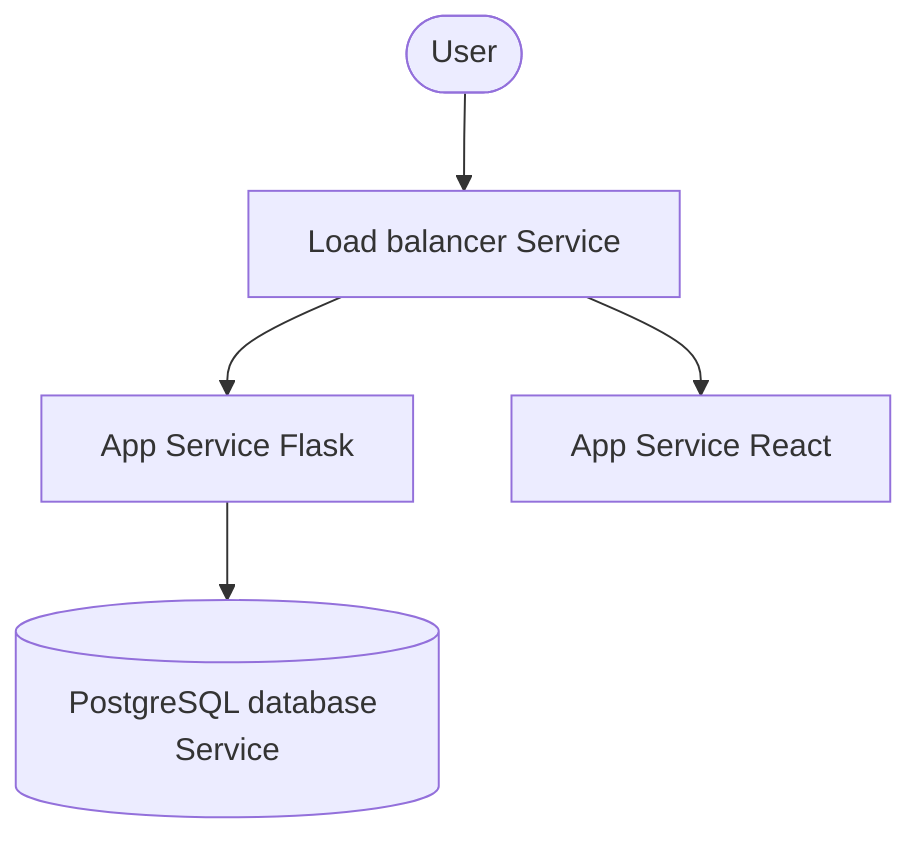

# LAB 2 
## On-permises infrastructure

### Description
For on-permises infrastructure, we can : 
- Deploy a VMWare VSphere to host the Virtual machines hosting every apps, databases and load balancers. We deploy many of each in case of failover.
- Install a Firewall to protect the Virtual machines. The user access the apps through the firewall.
- use the load balancers to balance between the apps depending on their availability. The load balancers are installed in virtual machines.
- Only the backend Flask app can communicate with the database.

## Cloud using IaaS infrastructure

### Description
For cloud using IaaS infrastructure, we can :
- Use the cloud load balancer technology as a load balancer. 
- Deploy the virtual machines for the database, the React and the Flask app
- Use the same communication rules as the on-permise infrastructure.

## Cloud using PaaS

### Description
For cloud using PaaS infrastructure, we can :
- Deploy only the code using the cloud app services (AWS Elastic Beanstalk, Azure App Service or Google Cloud Run)
- Use the PostGreSQL database service of the cloud 
- Use the cloud load balancer service

